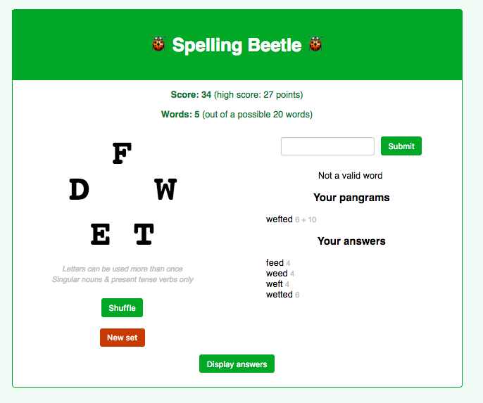
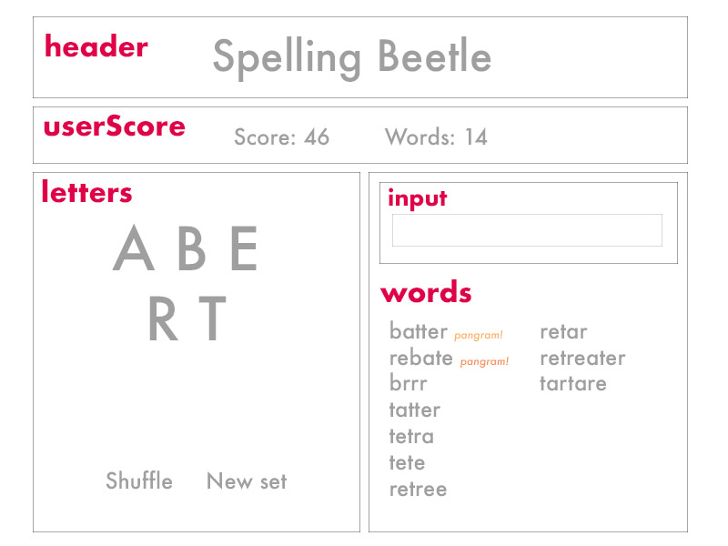

# About this project 

I love the NYT's [Spelling Bee](https://www.nytimes.com/puzzles/spelling-bee) word jumble game so much that I wanted to make a game I could practice on as a final project for General Assembly's JavaScript Development Course. I call my game **Spelling Beetle**. 



## Project deliverables
JavaScript front end that:
- randomly chooses a pangram word jumble problem
- takes user input
- evaluates answers
- scores user progress
- looks pretty

### Technologies used
- React.js, a library that enables a UI that updates automatically 
- Python script to create word list

### Approach
#### General
Most state variables and functions are stored in App.js and passed on to multiple components. State variables include data from the JSON file (such as valid answers) and user data (such as submitted answers). 

#### Detailed 
First, I made a wireframe and identified the areas of the page that would later become components. I wrote pseudocode that explained what would happen when the page loaded and when a user submitted a guess. I made **todo.md** to prioritize features and keep track of my progress.

I made the JSON data file (see *Make word lists* section below) using a Python script and a large list of words. The structure of the JSON file is inspired by (yet different from) the NYT Spelling Bee game. 

Then I created a new React app and set up the components I made. I took care of the easy things first, like making buttons and headers. Then I tackled loading in and displaying the JSON data, which was stored within the app at first. The letters, answers, and pangrams are stored as state variables. The chosen word set was hard-coded at first, then randomized later. Once the letters were appearing on the page, I consulted the React documentation to figure out how to accept and store user input, which ended up being easier than expected. 

I wrote a function called evaluateWord() that compared user input to the list of valid answers stored in the JSON data file. Finally, I stored the JSON data file remotely in a different online location and wrote code to treat this remote JSON file as an API, using the React documentation. Once that was finished, the bare minimum of the game was complete. 

Bells and whistles included shuffling letters, getting a new randomly-chosen word set, displaying user score, displaying a high score, toggling open answers, and linking each answer to a dictionary page.

All told, I built the MVP in about 5 hours and spent about 12 hours total on the project, including making the word lists. 

## Wireframe



### Reflections 
- React is easier than expected to work with. It helped to build Barkstagram in class to understand how components and state variables worked. 
- However, React is less forgiving than something like jQuery. Any error broke the page (since I didn't encode any kind of error handling). Some errors/warnings had very understandable error messages that showed up in the console. I could not resolve other errors, like "Cannot read property 'bind' of undefined," so instead I worked around them. 
- I wanted to incorporate some jQuery-like things, such as toggling open the answers pane, but a 5-second perusal of Google search results for "using jQuery in React" made me rethink using 2 libraries at once. So I coded the toggling as a function in React. 
- I pass so many state variables on to multiple components that I felt this might not be the right approach — should have used fewer components, maybe? But it works as is. 
- Auto-rendering on the page is AMAZING. As soon as a state variable is changed, the page display updates. No need to have a database to store user input. 
	
### Future features
- Show/hide answers (done)
- Add feature to display definitions, so that you can see what bonkers-sounding words like 'hobbinoll' and 'waubeen' mean  (done)
- Fun alert when high score is reached (make more visual?)
- Blank out letters when New Set is clicked (couldn't figure this out) 
- Make letters clickable/tappable for mobile
- Add 6-, 7-, and 8-letter pangram word set choices
- Rank pangram difficulty according to word frequency
- Error handling
- Make word jumble JSON data into an API

---

### Making word lists
I used [NLTK's 200k word list](http://www.nltk.org/) as my starter list of words. It's harder than you think to find an acceptable list of words, so somewhat obscure words like *blini* are included but non-words like *mpeg* are not. Moreover, including super obscure words like *poroporo* will make some users feel frustrated, especially if the only pangram is super obscure. Anyway, the NLTK list is the best I've found so far, but it does lean toward the obscure. 

To make your own word jumble set in a text editing program... 
1. Strip out words shorter than *n* letters long, depending on your rules (I chose 4) 
1. Strip out words with punctuation 
1. Strip out words beginning with a capital letter (proper nouns and acronyms)
1. Optional: Strip out words that contain 's' (this seems to be the NYT's approach, so that word jumble answers are never boring lists of singular/plural forms — I kept S words because the NLTK list does not include plurals)

Then run your .txt file through **listmaker.py**, which will generate a .json file with *m*-letter-long pangrams and all possible answers to the word jumble. 

Sample output: 
```
wordSet = [
	{
	"validLetters": ["e", "j", "k", "r", "y"], 
	"validPangram": ["jerky"], 
	"validAnswers": ["eker", "eyer", ... "yerk"]
	},
]
``1
